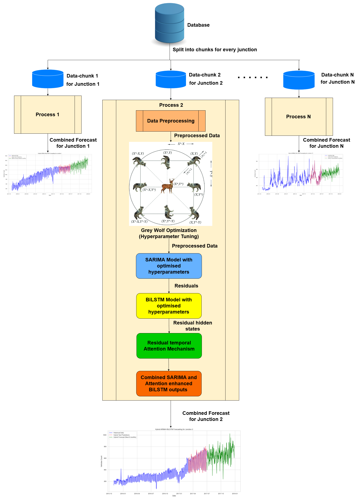

# Hybrid AI Pipeline for High-Performance Real-Time Urban Traffic Forecasting 🚦

<div align="center">
  
</div>

> **A Temporal Attention-Based SARIMA–BiLSTM Residual Learning Model Tuned by Grey Wolf Optimizer for Parallel Urban Traffic Forecasting:**
> A Statistical + Deep Learning based optimized novel hybrid architecture for forecasting time series data. SARIMA is used for statistical modelling, BiLSTM is used for residual modelling, and Attention Mechanism (Residual Temporal Attention) is used for attending to the most important residual BiLSTM hidden states for better and robust predictive performance. Additionally, nature inspired swarm-intelligence based Grey Wolf algorithm is leveraged for optimizing the model hyperparameters.

<table>
<tr>
<td width="50%" valign="top">

## 📋 Table of Contents
- [Overview](#-overview)
- [Problem Statement](#-problem-statement)
- [Understanding the Pipeline](#-understanding-the-pipeline)
- [How It Works](#-how-it-works)
- [Key Features](#-key-features)
- [Technology Stack](#️-technology-stack)
- [Performance](#-performance)
- [Research Impact](#-research-impact)
- [License](#-license)
- [Citation & Paper Link](#-citation)
- [Contact & Contributions](#-contact--contributions)

</td>
<td width="50%" valign="top" align="center">

</td>
</tr>
</table>

## 🎯 Overview

This project presents a novel hybrid residual learning AI pipeline that revolutionizes urban traffic forecasting by combining **SARIMA** with **BiLSTM networks** enhanced by **temporal attention mechanism**. Optimized through **Grey Wolf Optimization (GWO)** and accelerated with parallel processing, the system achieves exceptional accuracy and scalability for real-time traffic prediction applications.

## 🚨 Problem Statement

### Current Challenges
- **🌊 High temporal variability** in urban traffic patterns
- **🗺️ Spatial complexity** across transportation networks
- **🔀 Nonlinear dependencies** that traditional models struggle to capture
- **⏱️ Real-time processing** requirements for large-scale traffic data
- **🎯 Hyperparameter tuning** complexity in hybrid models

### What Our Solution Provides
- Captures both linear seasonal patterns and nonlinear dynamics
- Provides real-time forecasting with 99.31% accuracy
- Scales efficiently through parallel processing architecture
- Automates optimization through bio-inspired algorithms
- Delivers 10.11× processing speedup over conventional approaches

### 🧠 Understanding the Pipeline
## 🎯 What the "parallel_forecast.py" script does
There are two implementations provided - one is "sequential_forecast.ipynb" that implements the entire hybrid pipeline sequentially for all the traffic junctions, which is time consuming. Where as the "parallel_forecast.py" processes different traffic junctions parallelly, resulting in 10x computational speedup.

It predicts future traffic volumes (or any time-series variable like “Vehicles”) by blending two different forecasting methods:

- **SARIMA (ARIMA with seasonality)** - to capture linear and seasonal patterns.

- **BiLSTM (Bidirectional LSTM)** - to learn and correct the nonlinear residual errors left behind by SARIMA.

- **Attention Mechanism (Residual Temporal Attention)** - to select (attend to) the most important residual BiLSTM hidden states, focusing on critical temporal features to improve forecast accuracy by weighting relevant time steps.

The result is a hybrid pipeline that combines the best of both worlds: statistical forecasting + deep learning.

## ⚙️ Step-by-step Conceptual Flow

### 🪶 Step 0 — Multiprocessing Setup
Uses spawn start method to safely run TensorFlow models in parallel processes.
Each traffic junction is processed independently.

### 📊 Step 1 — Data Loading & Splitting
The dataset (Processed_Data.csv) has daily vehicle counts for multiple junctions.
For each junction, the time series is extracted and split into:
- **80% Training set**
- **20% Testing set**

### 🐺 Step 2 — Grey Wolf Optimizer (GWO) for SARIMA Tuning
Instead of manually guessing SARIMA parameters (p,d,q) and (P,D,Q,m), a metaheuristic called Grey Wolf Optimizer automatically searches for the best ones.
- GWO simulates how wolves hunt prey — exploring and converging toward the best solution over several iterations.
- **The goal:** minimize MAPE (Mean Absolute Percentage Error) on test data.
- **Result** → Best SARIMA model with lowest forecasting error.

### 📈 Step 3 — Fit SARIMA and Compute Residuals
The best SARIMA model is trained using the training data.
It predicts both training and testing portions.
Then, the residuals (differences between actual and predicted values) are computed:

> [!IMPORTANT]
> 🧮 **Residuals =** `Actual_Value − SARIMA_Prediction`

These residuals represent nonlinear patterns that SARIMA failed to capture.

### 🧩 Step 4 — Train BiLSTM on Residuals
Residuals are scaled between 0–1 using MinMaxScaler.
They are turned into supervised sequences (sliding windows).
A Bidirectional LSTM neural network learns how these residuals evolve over time — basically learning SARIMA’s “mistakes.”

### 🧠 Step 5 — Residual Temporal Attention Mechanism
After the BiLSTM processes the residual sequence, the **Residual Temporal Attention (RTA)** mechanism identifies which time steps are most important for accurate forecasting. **This attention mechanism is implemented as a neural network** that learns to assign importance weights dynamically.

#### Hidden State Representation
The BiLSTM generates a sequence of hidden states for the most recent $k$ residual time steps:

$$\{h_{t-k}, \ldots, h_{t-1}\}$$

where each $h_{t-i} \in \mathbb{R}^d$ encodes information about residual $R_{t-i}$, with $i \in \{1, 2, \ldots, k\}$.

#### Attention Weight Calculation via Neural Network
**A neural network layer computes** normalized attention weights $\alpha_i$ to measure each hidden state's relevance:

$$\alpha_i = \frac{\exp\left(w_a^T \tanh(W_r h_{t-i} + b)\right)}{\sum_{j=1}^{k} \exp\left(w_a^T \tanh(W_r h_{t-j} + b)\right)}$$

**Where:**
- $W_r \in \mathbb{R}^{d_a \times d}$: Learnable weight matrix projecting hidden states to attention space
- $b \in \mathbb{R}^{d_a}$: Learnable bias term for attention projection
- $\tanh(\cdot)$: Nonlinear activation function
- $w_a \in \mathbb{R}^{d_a}$: Learnable attention vector for scoring (trained end-to-end)
- $\alpha_i \in [0, 1]$: Normalized attention weight (all weights sum to 1)

> **Note:** The parameters $W_r$, $b$, and $w_a$ are learned during training through backpropagation, allowing the neural network to automatically discover which temporal patterns matter most.

#### Context Vector Formation
The attention weights are used to create a weighted context vector that aggregates the most relevant temporal features:

$$c_t = \sum_{i=1}^{k} \alpha_i h_{t-i}$$

where $c_t \in \mathbb{R}^d$ represents the attention-weighted combination of hidden states.

#### Final Residual Prediction
The context vector is passed through a **fully connected neural network layer** to produce the final residual forecast:

$$\hat{R}_t^{(attn)} = W_o c_t + b_o$$

**Where:**
- $W_o \in \mathbb{R}^{1 \times d}$: Learnable output weight matrix
- $b_o \in \mathbb{R}$: Learnable output bias term
- $\hat{R}_t^{(attn)}$: Attention-enhanced residual prediction

#### Neural Network Architecture
The complete attention mechanism consists of:
1. **Projection Layer**: Maps BiLSTM hidden states to attention space ($W_r$, $b$)
2. **Attention Scoring Network**: Computes importance scores using $w_a$
3. **Softmax Normalization**: Converts scores to probability distribution
4. **Output Dense Layer**: Transforms context vector to final prediction ($W_o$, $b_o$)

#### Key Advantage
This **trainable neural network-based attention mechanism** allows the model to **dynamically learn and focus** on the most informative past residuals, improving prediction accuracy by automatically discovering which historical patterns are most relevant for the current forecast.

### 🧮 Step 6 — Combine Both Models
The Attention enhanced BiLSTM predicts future residuals.

> [!IMPORTANT]
> 🧮 **Final hybrid prediction =** `SARIMA_Prediction + LSTM_Attention_Residual_Prediction`

This correction step gives smoother, more accurate forecasts.

### 🔮 Step 7 — Forecast Future Values
SARIMA produces a future forecast for the desired horizon (e.g., 180 days).
BiLSTM predicts corresponding residuals for the same horizon in an iterative loop.
Residual Temporal Attention Mechanism identifies the most important past residual time steps for accurately predicting the future residuals, thus enhancing the BiLSTM's output.
**Both are added together → Hybrid Forecast.**

### 🖼️ Step 8 — Visualization & Saving
Each junction’s hybrid forecast is plotted and saved as a PNG file.
CPU and memory usage are monitored and plotted (resource_usage.png).
A summary CSV (hybrid_results_summary.csv) logs all junction-level results and MAPE values.

### 💻 Step 9 — Multiprocessing Orchestration
The main() function:
- Spawns multiple worker processes (one per junction).
- Monitors system resources.
- Collects results from all workers.
- Saves everything neatly at the end.

### 🪶 In short:
SARIMA handles the linear trend, BiLSTM handles the nonlinear leftovers, and GWO automatically fine-tunes the SARIMA parameters.
Together, they form a robust hybrid forecasting pipeline that runs in parallel.

## 🔄 How It Works

### Step 1: Seasonal Pattern Recognition 📈
- **SARIMA Component**: Captures underlying seasonal and linear patterns in traffic flow
- **Time Series Decomposition**: Identifies trend, seasonality, and cyclical components
- **Linear Modeling**: Handles predictable traffic patterns and baseline forecasting

### Step 2: Residual Learning 🧠
- **BiLSTM Network**: Processes residuals representing unmodeled nonlinear dynamics
- **Bidirectional Processing**: Captures both past and future temporal dependencies
- **Nonlinear Pattern Recognition**: Learns complex traffic behaviors and anomalies

### Step 3: Temporal Attention Enhancement 🎯
- **Residual Temporal Attention (RTA)**: Selects most important residual BiLSTM hidden states
- **Attention Mechanism**: Focuses on critical temporal features for final forecast
- **Enhanced Prediction**: Improves accuracy by weighting relevant time steps

### Step 4: Grey Wolf Optimization 🐺
- **Bio-inspired Algorithm**: Mimics hunting behavior of grey wolf packs
- **Automated Hyperparameter Tuning**: Optimizes both SARIMA and BiLSTM parameters
- **Multi-objective Optimization**: Balances accuracy and computational efficiency
- **Adaptive Search**: Finds optimal configuration without manual intervention

### Step 5: Parallel Processing & Deployment ⚡
- **Parallel Architecture**: Processes multiple traffic streams simultaneously
- **Scalable Design**: Handles large-scale urban traffic networks
- **Real-time Inference**: Delivers predictions with minimal latency

## ✨ Key Features

🎯 **Exceptional Accuracy**: Achieves **99.31% forecasting accuracy** on real-world datasets  
🐺 **Bio-inspired Optimization**: Uses Grey Wolf Optimizer for automated hyperparameter tuning  
🧠 **Hybrid Architecture**: Combines SARIMA linear modeling with BiLSTM nonlinear learning  
⚡ **10.11× Speedup**: Parallel processing delivers significant performance improvement  
🎭 **Attention Mechanism**: Temporal attention enhances prediction quality  
🌐 **Real-World Tested**: Validated on actual urban traffic datasets  
🚀 **Scalable Solution**: Built for large-scale transportation networks  
📊 **Residual Learning**: Captures complex nonlinear traffic dynamics

## 🛠️ Technology Stack

### Core Architecture
- **📈 SARIMA**: Seasonal Autoregressive Integrated Moving Average for linear patterns
- **🧠 BiLSTM**: Bidirectional Long Short-Term Memory for nonlinear dynamics
- **🎯 RTA**: Residual Temporal Attention Mechanism for feature selection
- **🐺 GWO**: Grey Wolf Optimizer for hyperparameter optimization

### Advanced Features
- **🔄 Residual Learning**: Separates linear and nonlinear components
- **⚡ Parallel Processing**: Multiple processes executing for scalability
- **🎭 Attention Weights**: Temporal importance scoring
- **📊 Hybrid Pipeline**: Seamless integration of statistical and deep learning models

### Performance Optimization
- **🚀 Parallel Execution**: Concurrent processing of traffic data for different urban junctions
- **⚙️ Automated Tuning**: Eliminates manual hyperparameter selection
- **💾 Efficient Memory**: Optimized for large-scale data processing
- **⏱️ Real-time Inference**: Low-latency prediction pipeline

## 🎯 Performance

The AI-powered traffic forecasting system demonstrates outstanding performance across multiple metrics:

- ✅ **99.31% Accuracy** on real-world traffic datasets
- ✅ **10.11× Processing Speedup** through parallel architecture
- ✅ **Outperforms baseline models** including traditional and hybrid approaches
- ✅ **Real-time capability** for urban traffic networks
- ✅ **Scalable deployment** across large transportation systems

### Performance Highlights
- **🏆 State-of-the-art accuracy** in traffic forecasting
- **⚡ Significant speedup** over conventional single-threaded models
- **🎯 Production-ready** for real-time applications
- **📊 Robust performance** across different traffic patterns and conditions
- **🔧 Automated optimization** reduces development complexity

## 🔬 Research Impact

This project contributes to multiple research domains:
- **🚦 Transportation Engineering**: Advanced traffic prediction methodologies
- **🤖 Machine Learning**: Novel hybrid residual learning pipeline
- **🐺 Bio-inspired Computing**: Application of GWO in time series optimization
- **⚡ Parallel Computing**: Scalable architectures for real-time forecasting
- **🏙️ Smart Cities**: Intelligent transportation system solutions

### Key Innovations
- **🔄 Hybrid Residual Pipeline**: Combines statistical and deep learning strengths
- **🎭 Temporal Attention**: Enhanced focus on critical time dependencies
- **🐺 Automated Optimization**: Bio-inspired hyperparameter tuning
- **⚡ Parallel Scalability**: Efficient processing for large-scale deployment

## 📄 License
This project is licensed under the MIT License - see the [LICENSE](LICENSE) file for details.

## 📚 Citation
If you use this work in your research or projects, please cite our paper:
```bibtex
@article{das2025temporal,
  title={A Temporal Attention-Based SARIMA--BiLSTM Residual Learning Model Tuned by Grey Wolf Optimizer for Parallel Urban Traffic Forecasting},
  author={Das, Manas Kamal and Columbus, C Christopher and Elakiya, E},
  journal={IEEE Access},
  year={2025},
  publisher={IEEE}
}
```

**Paper Link**: [IEEE Access](https://ieeexplore.ieee.org/abstract/document/11083601)

## 📬 Contact & Contributions
For questions, issues, or contributions, please open an issue or submit a pull request on the repository.

---

**⚠️ Note**: This system is designed for research and commercial applications in traffic forecasting. Performance may vary based on traffic patterns, data quality, and deployment environment.

*For detailed methodology, experimental setup, and comprehensive results, please refer to the complete research documentation.*
